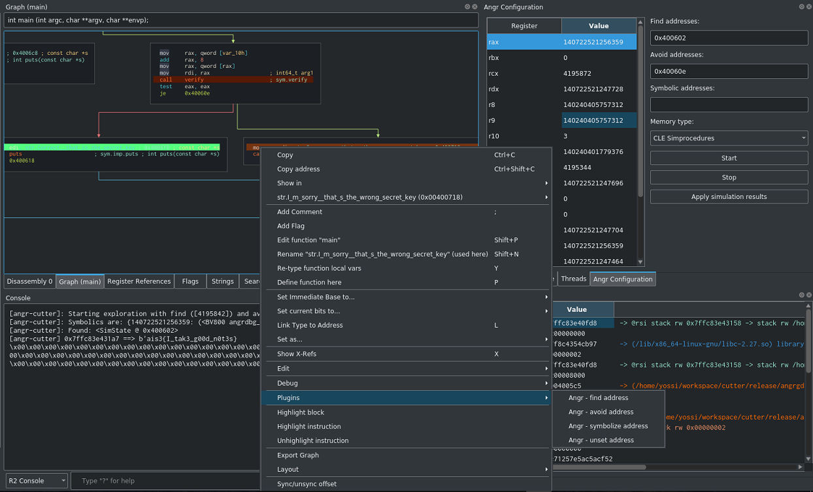

## AngrCutter

<p align="center">
    
</p>

### About

Cutter debug session integration with [angr](https://github.com/angr/angr) using the [angrdbg](https://github.com/andreafioraldi/angrdbg)
API.

Integrating Angr into Cutter allows dynamic symbolic execution on binaries analyzed by
Cutter using Cutter's debug state. For more information on angr see [angr-doc](https://docs.angr.io/core-concepts)
and the [angr paper](https://www.cs.ucsb.edu/~vigna/publications/2016_SP_angrSoK.pdf).

### GUI

<p align="center">
    
</p>

AngrCutter adds a self-explanatory widget that lets you start/stop exploration, enable register symbolization
and apply the exploration's results in the current debug session.

In addition to the widget, the plugin adds address interaction options to the disassembly
context menu(Available in the Disassembly and Graph widget) and addressable context menu(Available
when right clicking addresses in most widgets).

### Examples
There are examples in the [examples](examples/) folder with short writeups.

### Installation
Simply checkout or download the repository and copy the angrcutter folder to your cutter plugins directory ([locating the plugins directory](https://github.com/radareorg/cutter/blob/master/docs/source/plugins.rst#loading-and-overview)).

#### Dependencies

AngrCutter depends on [angr](https://github.com/angr/angr) and [angrdbg](https://github.com/andreafioraldi/angrdbg),
to install run:

```
python3 -m pip install angr
python3 -m pip install angrdbg
```

### Other Debuggers

See [angrdbg](https://github.com/andreafioraldi/angrdbg) for other debugger frontends for angr.
